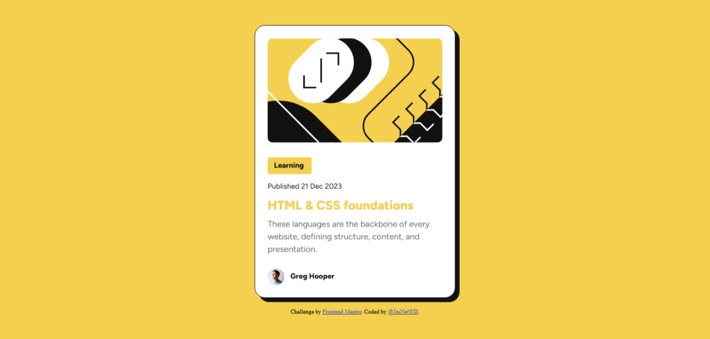

# Frontend Mentor - Blog preview card solution

This is a solution to the [Blog preview card challenge on Frontend Mentor](https://www.frontendmentor.io/challenges/blog-preview-card-ckPaj01IcS). Frontend Mentor challenges help you improve your coding skills by building realistic projects.

## Table of contents

- [Overview](#overview)
  - [The challenge](#the-challenge)
  - [Screenshot](#screenshot)
  - [Links](#links)
- [My process](#my-process)
  - [Built with](#built-with)
  - [What I learned](#what-i-learned)
  - [Continued development](#continued-development)
  - [Useful resources](#useful-resources)
- [Author](#author)

## Overview

### The challenge

Users should be able to:

- See hover and focus states for all interactive elements on the page

### Screenshot

 
 
 **Hover State**
 

### Links

- Solution URL: [Solution URL](https://www.frontendmentor.io/solutions/responsive-blog-preview-card-using-css-flexbox-wDaJVguO-A)
- Live Site URL: [Live site URL](https://jesnetwd.github.io/Frontend-Mentor-Blog-preview-card/)

## My process

### Built with

- Semantic HTML5 markup
- CSS custom properties
- Flexbox

### What I learned

I applied proper naming to make my code readable. I used flexbox to make my code responsive.

```html
<div class="card-thumbnail">
  
</div>
<div class="card-body">
  <div class="card-tag">Learning</div>
  <p class="card-date">Published 21 Dec 2023</p>
  <h2>HTML & CSS foundations</h2>
  <p class="card-description">
    These languages are the backbone of every website, defining structure,
    content, and presentation.
  </p>
</div>
```

```css
.container {
  height: 100vh;
  display: flex;
  justify-content: center;
  align-items: center;
  background-color: #f4d04e;
}

.card {
  background-color: #ffffff;
  border: 1px solid #121212;
  border-radius: 1.25rem;
  padding: 1.5rem 1.5rem 0;
  margin: 0 1em;
  min-width: 320px;
  width: 380px;
  font-family: "Figtree Light";
  box-shadow: 10px 8px #121212;
  display: flex;
  flex-direction: column;
  row-gap: 1.5em;
  justify-content: center;
}
```

### Continued development

I would like to learn about CSS grids.
I would also like to learn more about spacing, layout, and design.

### Useful resources

- [24 CSS Projects: Loading Animations, Progress Bars, Flashcards & More!](https://www.youtube.com/watch?v=TzuWIHGFKCQ&pp=ygUPMjQgY3NzIHByb2plY3Rz) - There is a project in this video that is somewhat similar to this. Some other projects in this video also helped me understand flexbox better, which I then properly incorporated in my solution for this project.

## Author

- LinkedIn - [Jessica Nwoye](www.linkedin.com/in/jessica-nwoye-45330b311)
- Frontend Mentor - [@JesNetWD](https://www.frontendmentor.io/profile/JesNetWD)
